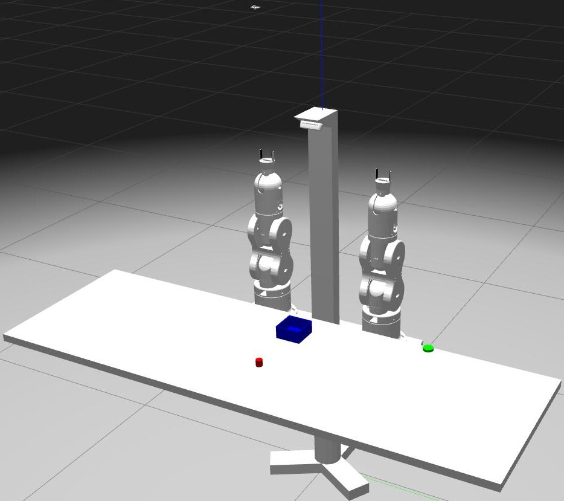
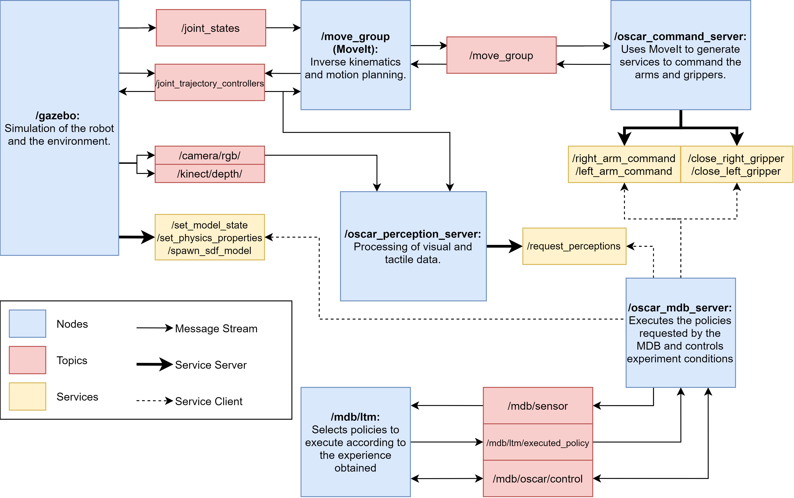

# OSCAR
Repository for OSCAR (Open Source Cognitive Applied Robot)

OSCAR is a robotic platform based on the [Thor robot arm](https://github.com/AngelLM/Thor) created by AngelLM. It is designed to be applied in cogntive learning and has been integrated with the *Multilevel Darwinist Brain* [1] cognitive architecture. Currently, it is implemented only in the Gazebo simulator.

The implementation of the Thor arm in gazebo simulator is in [this repo](https://github.com/efallash/thor_simulator)

OSCAR is composed of two Thor arms, and simulated cameras ([Realsense D435](https://www.intelrealsense.com/depth-camera-d435/) and [RPi Camera Module V2](https://www.raspberrypi.org/documentation/hardware/camera/)). It is implemented using ROS and MoveIt, which allows a modular software architecture for easy integration with other cognitive frameworks. 

The ROS architecture of OSCAR is shown in the following diagram:

## Repository index

 - oscar_bringup: Launch files to start the simulation.
 - oscar_common: Command server code and a manipulation test called change_hands.
 - oscar_description: Xacro description files of the robot.
 - oscar_gazebo: World and model files for gazebo.
 - oscar_mdb: Code, configuration and launch files for oscar_mdb_server.
 - oscar_moveit_config: MoveIt configuration files generated by the setup assistant.
 - oscar_msgs: Message files for the services.
 - oscar_perception: Code of the perception server.
 - oscar_tests: Multiple scripts that run precision, manipulation and perception tests.

## Installation

The following installation guide assumes a clean installation of Ubuntu 20.4 (Focal Fossa). 

### Required packages

Install ROS noetic following the instructions [here](http://wiki.ros.org/noetic/Installation/Ubuntu)

Install MoveIt 1:
    
    sudo apt install ros-noetic-moveit

Install ROS Control:

    sudo apt-get install ros-noetic-ros-control ros-noetic-ros-controllers

Install catkin_tools (RECOMMENDED):

    sudo apt-get install python3-catkin-tools
    sudo apt install python3-catkin-lint python3-pip
    pip3 install osrf-pycommon

### Required Python packages

The required python packages can be installed using pip3:

Pandas
  
    pip3 install pandas

Scikit-Image

    pip3 install scikit-image

CameraTransform

    pip3 install cameratransform

The following Python packages are required by MDB:

Yamlloader

    pip3 install yamlloader

Tensorflow

    pip3 install --user --upgrade tensorflow

Dash and Cytoscape

    pip3 install dash
    pip3 install dash-cytoscape

Networkx

    pip3 install networkx

### Creating a catkin workspace

ROS packages must be contained in a workspace to work properly. To create a workspace using catkin tools first you must create a empty folder in the home folder (recommended) generally called catkin_ws with a src folder:

    cd
    mkdir catkin_ws/src

Initialize the workspace:

    cd catkin_ws/
    catkin init
    catkin build

To use the workspace you must source its setup file everytime you open a terminal:

    source catkin_ws/devel/setup.bash

Alternatively, you can add this line to .bashrc to avoid sourcing manually:

    cd
    echo "source ~/catkin_ws/devel/setup.bash" >> ~/.bashrc
    source ~/.bashrc

### Downloading the source code

Download this repository and the [thor_simulator](https://github.com/efallash/thor_simulator) in the src folder of your workspace

    cd
    cd catkin_ws/src/
    git clone https://github.com/efallash/oscar.git
    git clone https://github.com/efallash/thor_simulator.git

The MDB code is not published yet, you can contact the [GII](https://github.com/GII) if you need access. 

After cloning the repositories build and re-source your workspace.

## Usage

### Robot bringup
Run the following line in a terminal to launch the robot in the table world:

    roslaunch oscar_bringup oscar_table.launch

You can also pass the following arguments to the launch file:

- gui: Boolean to enable or disable the gazebo graphical interface.
- controller_number: Selects the controller from the folder oscar_control/config.
- load: Boolean to enable or disable a fixed load in the gripper (testing purposes).
- mass: Float to select the mass of the fixed load in kg. 

### ROS API
Once you have launched the robot, the following services to control the robot are available:

- /right_arm_command
- /left_arm_command 
- /close_right_gripper
- /close_left_gripper

To command the arms the following message is used:

    float32 x
    float32 y
    float32 z 
    float32 vel 
    string named_pose
    ---
    bool plan
    bool execute

You can command a 3D point for the end effector, the server will choose automatically the orientation. The server returns the success of the planning and the execution.

To command the grippers the following message is used:

    bool close
    ---
    bool object

With the message you ask the gripper to close with a boolean value. 

Every service can be used via CLI using [rosservice](http://wiki.ros.org/rosservice).

The camera data can be accesed in the following topics:

- /kinect/depth/
- /camera/rgb/

### Executing cognitive experiments

To execute the cognitive experiments it is necessary to have the MDB packages in the active workspace. Then, you can launch experiments with the following line:

    roslaunch oscar_mdb ltm_oscar

The experiment can be configurated by editing the file ltm_config_oscar.yaml contained in the oscar_mdb/config folder.

## Acknowledgements

Thanks to the members of the [LIANA](https://www.tec.ac.cr/unidades/laboratorio-inteligencia-artificial-ciencias-naturales-liana) for their support in this project. And thanks to the [GII](https://github.com/GII) for sharing their cognitive architecture.

## References

[1] J. A. Becerra, A. Romero, F. Bellas, and R. J. Duro, “Motivational engine andlong-term memory coupling within a cognitive architecture for lifelong open-ended learning,” *Neurocomputing*, 11 2020. doi: https://doi.org/10.1016/j.neucom.2019.10.124

