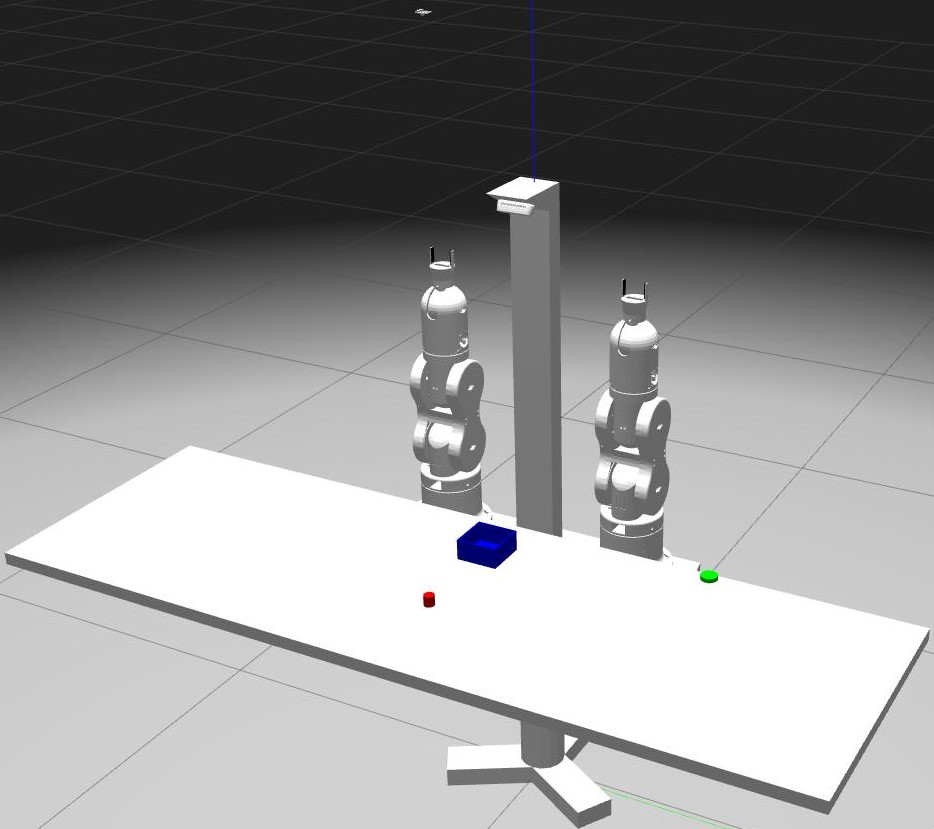
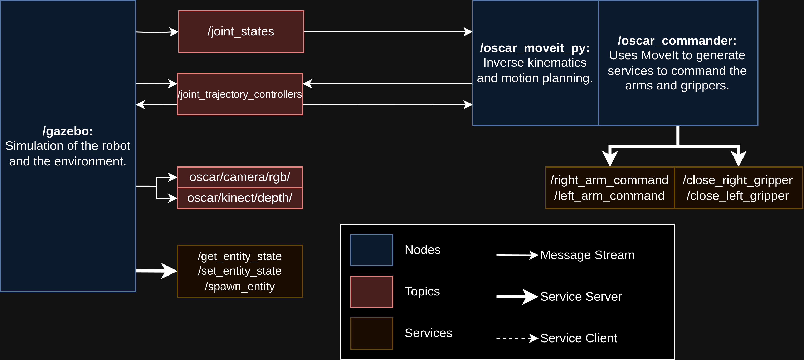
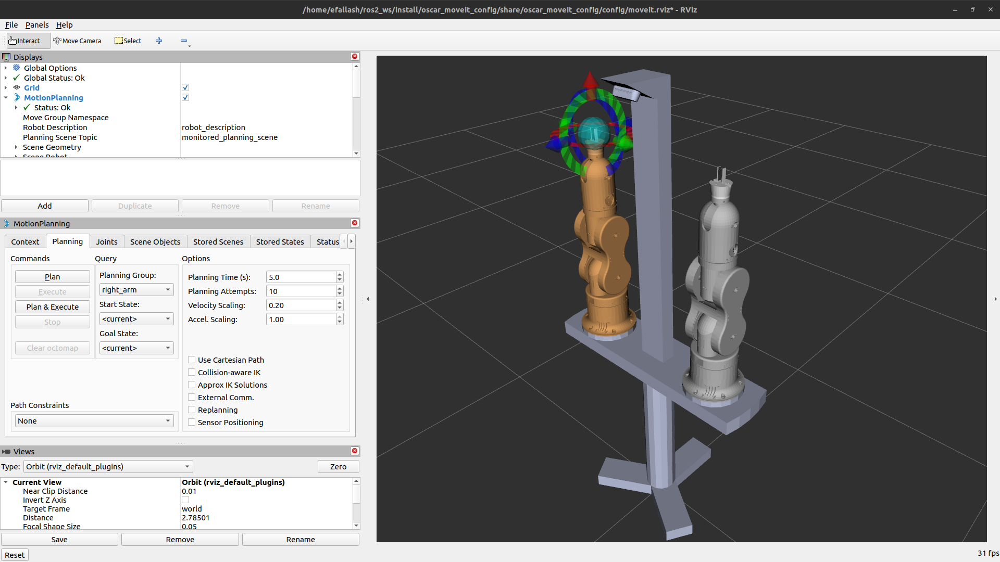

# OSCAR
Repository for OSCAR (Open Source Cognitive Applied Robot)

OSCAR is a robotic platform based on the [Thor robot arm](https://github.com/AngelLM/Thor) created by AngelLM. It is designed to be applied in cogntive learning and has been integrated with the *Multilevel Darwinist Brain* [1] cognitive architecture. Currently, it is implemented only in the Gazebo simulator.

The implementation of the Thor arm in gazebo simulator is in [this repo](https://github.com/efallash/thor_simulator)

OSCAR is composed of two Thor arms, and simulated cameras ([Realsense D435](https://www.intelrealsense.com/depth-camera-d435/) and [RPi Camera Module V2](https://www.raspberrypi.org/documentation/hardware/camera/)). It is implemented using ROS2 and MoveIt2, which allows a modular software architecture for easy integration with other cognitive frameworks. 

The ROS architecture of OSCAR is shown in the following diagram:

## Repository index

 - oscar_bringup: Launch files to start the simulation.
 - oscar_description: Xacro description files of the robot.
 - oscar_gazebo: World and model files for gazebo.
 - oscar_moveit_config: MoveIt configuration files generated by the setup assistant.
 - ocsar_moveit_py: MoveIt python interface and commander server. Includes a manipulation demo script.
 - oscar_interfaces: Message files for the services.
 - oscar_tests: Multiple scripts that run precision, manipulation and perception tests. (**NOT PORTED TO ROS2 YET**)

## Installation

Is is strongly recommended to use this package with ROS2 Humble and Ubuntu 22.04. Moveit packages should be built from source to access the latest features (e.g. Python API). 

### Required packages

Install ROS2 Humble following the instructions [here](https://docs.ros.org/en/humble/Installation/Ubuntu-Install-Debians.html).

Install ROS2 Gazebo packages:
    
    sudo apt install ros-humble-gazebo-ros-pkgs ros-humble-gazebo-ros2-control ros-humble-gazebo-plugins 

Install ROS Control:

    sudo apt install ros-humble-ros2-control ros-humble-ros2-controllers 

Install TF transformations:

    sudo apt install ros-humble-tf-transformations

Build Moveit2 from source following the instructions [here](https://moveit.ros.org/install-moveit2/source/).

### Required Python packages

The required python packages can be installed using pip:

Pandas
  
    pip install pandas

Scikit-Image

    pip install scikit-image

CameraTransform

    pip install cameratransform

ROS2-Numpy

    pip install ros2-numpy

### Downloading the source code

Download this repository and the [thor_simulator](https://github.com/efallash/thor_simulator) in the src folder of your workspace

    git clone https://github.com/efallash/oscar.git -b humble_gazebo_classic
    git clone https://github.com/efallash/thor_simulator.git -b humble_gazebo_classic

After cloning the repositories build and source your workspace.

## Usage

### Robot bringup
Run the following line in a terminal to launch the robot in the table world:

    ros2 launch oscar_bringup oscar_table_launch.py

<!-- You can also pass the following arguments to the launch file:

- gui: Boolean to enable or disable the gazebo graphical interface.
- controller_number: Selects the controller from the folder oscar_control/config.
- load: Boolean to enable or disable a fixed load in the gripper (testing purposes).
- mass: Float to select the mass of the fixed load in kg.  -->

### ROS API
Once you have launched the robot, the following services to control the robot are available:

- oscar/right_arm_command
- oscar/left_arm_command 
- oscar/close_right_gripper
- oscar/close_left_gripper

To command the arms the following message is used:

    float32 x
    float32 y
    float32 z 
    float32 vel 
    string named_pose
    ---
    bool success
    string status

You can command a 3D point for the end effector, the server will choose automatically the orientation. The server returns the success of the execution and a status string. Also, you can pass a float between 0 and 1 to select the execution speed, if vel=0 only the planning is made.

The following named poses are available:

- home: Ready position for picking objects.
- upright: Every joint in their zero position.

To command the grippers the following message is used:

    bool close
    ---
    bool success

With the message you ask the gripper to close with a boolean value. 

Every service can be used via CLI using [ros2 service](https://docs.ros.org/en/humble/Tutorials/Beginner-CLI-Tools/Understanding-ROS2-Services/Understanding-ROS2-Services.html).

The camera data can be accesed in the following topics:

- oscar/kinect/depth/
- oscar/camera/rgb/

### Launch Moveit with RVIZ

You can launch OSCAR with rviz and use the interactive markers to command poses to the robot.

Launch moveit:

    ros2 launch oscar_moveit_config move_group.launch.py

Launch RViz:

    ros2 launch oscar_moveit_config moveit_rviz.launch.py

## References

[1] E. Fallas-Hernández, R. J. L. Baldares and J. L. Crespo, "OSCAR: A Low-Cost, Open-Source Robotic Platform Design for Cognitive Research," *2021 IEEE 3rd International Conference on BioInspired Processing (BIP)*, Cartago, Costa Rica, 2021, pp. 1-6, doi: 10.1109/BIP53678.2021.9612905.
